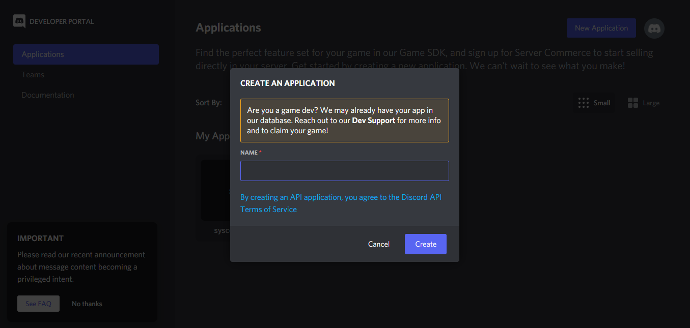
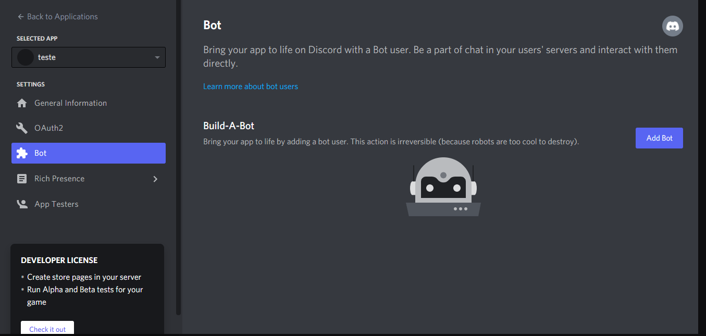
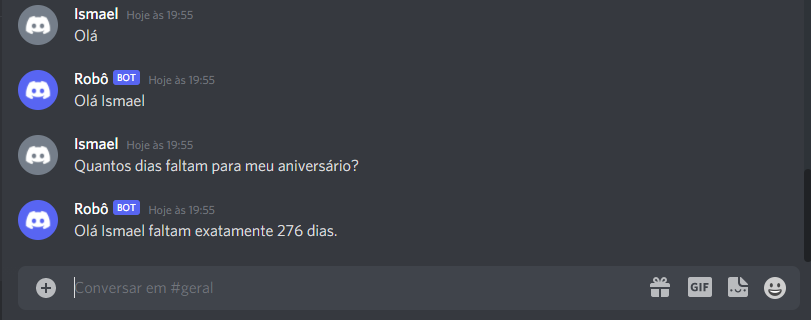

# Bot Discord

> Utilizando a bilblioteca [Javacord](https://javacord.org/) para criar um Robô que responde conforme as iterações dos usuarios em determinado grupo do Discord.

## 🚀 Instalando 

Para utilizar cadastre seu Bot acessando o [portal](https://discord.com/developers/) de desenvolvedor do Dicord e cadastre uma nova aplicação.

Ative seu Robô acessando o menu Bot, e clicando sobre Add Bot. Com isto será liberado o token para utilizar nesta aplicação.

Para adicionar seu bot em um grupo, acesse o link abaixo em um navegador trocando o client_id pelo id do seu bot.

<b>https://discord.com/api/oauth2/authorize?client_id=123456789&scope=bot&permissions=0</b>

## ☕ Utilizando o Bot

[⬆ Voltar ao topo](#Bot-Discord) 